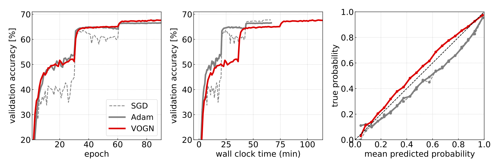

# Practical Deep Learning with Bayesian Principles
This repository contains code that demonstrate
practical applications of Bayesian principles to Deep Learning. 
Our implementation contains an Adam-like optimizer, called
[VOGN](http://proceedings.mlr.press/v80/khan18a.html),
 to obtain uncertainty in Deep Learning.

- 2D-binary classification (see [toy example](./toy_example))
- Image classification ([MNIST](./classification),
 [CIFAR-10/100](./classification), 
 and [ImageNet](./distributed/classification))
- Continual learning for image classification (permuted MNIST)
- Per-pixel semantic labeling & segmentation (Cityscapes) 

## Setup
This repository uses [PyTorch-SSO](https://github.com/cybertronai/pytorch-sso), a PyTorch extension for second-order optimization, variational inference, and distributed training.

```bash
$ git clone git@github.com:cybertronai/pytorch-sso.git
$ cd pytorch-sso
$ python setup.py install
```
Please follow the 
[Installation](https://github.com/cybertronai/pytorch-sso#installation) 
of PyTorch-SSO for CUDA/MPI support.


## Bayesian Uncertainty Estimation
Decision boundary and entropy plots on 2D-binary classification by MLPs trained 
with Adam and VOGN.

VOGN optimizes the posterior distribution of each weight (i.e., mean and variance of the Gaussian). 
A model with the mean weights draws the red boundary, and models with the MC samples from the posterior distribution draw light red boundaries.
VOGN converges to a similar solution as Adam while keeping uncertainty in its predictions.

With PyTorch-SSO (`torchsso`), you can run VOGN training by changing a line in your train script:
```python
import torch
import torchsso

train_loader = torch.utils.data.DataLoader(train_dataset) 
model = MLP()

#optimizer = torch.optim.Adam(model.parameters())
optimizer = torchsso.optim.VOGN(model, dataset_size=len(train_loader.dataset))

for data, target in train_loader:

    def closure():
        optimizer.zero_grad()
        output = model(data)
        loss = F.binary_cross_entropy_with_logits(output, target)
        loss.backward()
        return loss, output

    loss, output = optimizer.step(closure)

```

To train MLPs by VOGN and Adam and create GIF
```bash
$ cd toy_example
$ python main.py
```
For detail, please see [VOGN implementation in PyTorch-SSO](https://github.com/cybertronai/pytorch-sso/blob/master/torchsso/optim/vi.py).

## Bayes for Image Classification
This repository contains code for the NeurIPS 2019 paper "[Practical Deep Learning with Bayesian Principles](https://arxiv.org/abs/1906.02506),"
which includes the results of **Large-scale Variational Inference on ImageNet classification**.


VOGN achieves similar performance in about the same number of epochs as Adam and SGD.
Importantly, the benefits of Bayesian principles are preserved: predictive probabilities are well-calibrated (rightmost figure), 
uncertainties on out-of-distribution data are improved (please refer the paper),
and continual-learning performance is boosted (please refer the paper, an example is to be prepared).  

See [classification](./classification) (single CPU/GPU) or [distributed/classification](./distributed/classification) (multiple GPUs) for example scripts.


## Citation
NeurIPS 2019 paper
```
@article{osawa2019practical,
  title = {Practical Deep Learning with Bayesian Principles},
  author = {Osawa, Kazuki and Swaroop, Siddharth and Jain, Anirudh and Eschenhagen, Runa and Turner, Richard E. and Yokota, Rio and Khan, Mohammad Emtiyaz},
  journal = {arXiv preprint arXiv:1906.02506},
  year = {2019}
}
```
