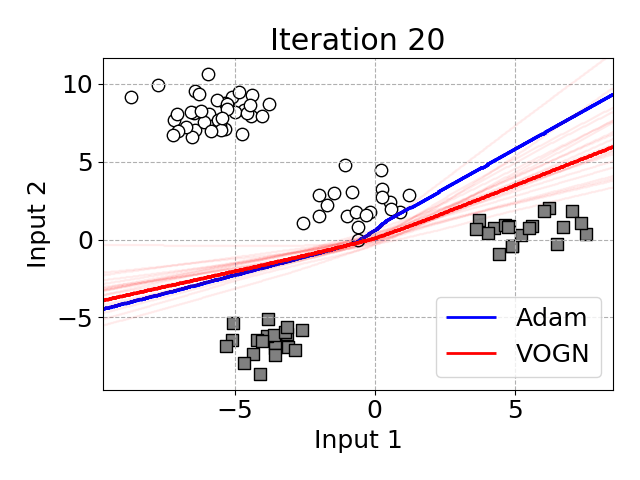

# Toy Example
Training MLP on 2D-binary classification.
```bash
$ cd toy_example
$ python main.py
```
This script creates following GIF.

Decision boundaries on 2D-binary classification by MLPs trained with Adam and VOGN.


VOGN optimizes the posterior distribution of each weight (i.e., mean and variance of the Gaussian). 
A model with the mean weights draws the red boundary, and models with the MC samples from the posterior distribution draw light red boundaries.
VOGN converges to a similar solution as Adam while keeping uncertainty in its predictions.
